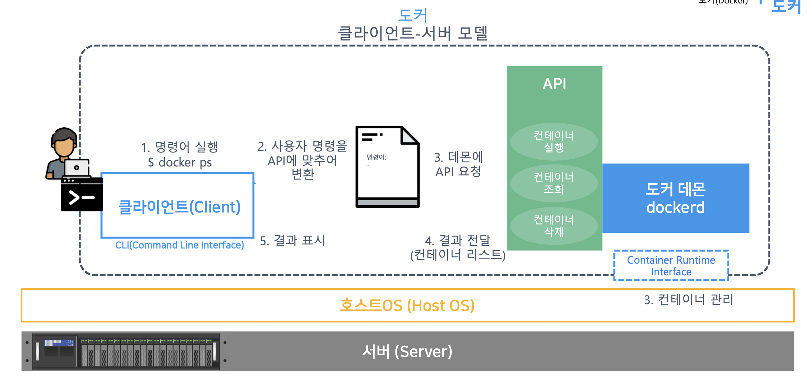

# 01. 가상화 기술
## 가상화
- 정의 : 한 대의 컴퓨터(HW + SW)로 여러 대의 컴퓨터를 사용하는 효과를 내는것.
- 왜 사용하는가? 
    1. 비용 절감 : 하나의 HW로 여러대의 컴퓨터를 가동하는 효과
    2. 안정성 : 분리된 컴퓨터들간 영향 최소화함

## Hypervisor 가상화
- Hypervisor : Host OS 위에서 동작하는 Application으로,  Guest OS에 Resource 를 할당, 운영함.
- 단점
    1. 성능 : GusetOS 위 응용 프로그램이 HostOS에서 처리되기 까지 오버헤드가 큼.
    2. 단일 장애 지점 : Hypervisor가 곧 단일 장애지점.
- ex ) VM Ware,  Virtual Box ...

||Hypervisor 가상화||
| --- | :---: | --- |
|GuestOS_1|GuestOS_2| GuestOS_3|
||Hypervisor||
||HostOS||
|| H/W ||

## Container 가상화
- Container : 커널의 컨테이너 격리 기술을 이용한 기술
- 장점 
    1. 성능: Hypervisor와 GuestOS 가 없는 만큼 오버헤드 감소.

||Container 가상화||
| --- | :---: | --- |
|Container_1|Container_2| Container_3|
||HostOS||
|| H/W ||

## Docker
- Container 가상화 기술을 사용할 수 있도록 돕는 컨테이너 플랫폼.
- 커널의 Container 가상화 기술을 사용할 수 있도록 인터페이스 역할을 수행.
